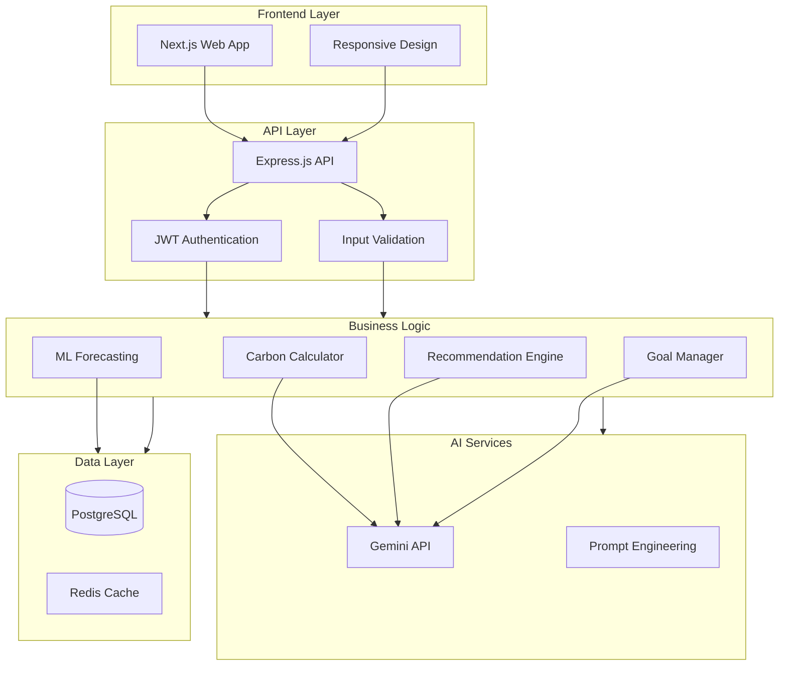

# EcoMind AI - System Architecture

## Overview

EcoMind AI is a full-stack web application built with modern technologies for optimal performance, scalability, and user experience.



## Technology Stack

### Frontend
- **Framework**: Next.js 14+ with React 18+
- **Language**: TypeScript
- **Styling**: Tailwind CSS
- **UI Components**: Shadcn UI
- **State Management**: React Context API / Zustand
- **HTTP Client**: Axios
- **Charts**: Recharts / Chart.js
- **Form Handling**: React Hook Form
- **Validation**: Zod

### Backend
- **Runtime**: Node.js
- **Framework**: Express.js
- **Language**: TypeScript
- **Database**: PostgreSQL
- **ORM**: Prisma
- **Validation**: Joi / Zod
- **Authentication**: JWT (jsonwebtoken)
- **Password Hashing**: bcrypt
- **Logging**: Winston
- **Testing**: Jest / Vitest

### AI & ML
- **LLM**: Google Gemini API
- **Recommendations**: Custom prompt engineering
- **Forecasting**: Simple ML models (polynomial regression)

### Infrastructure
- **Containerization**: Docker
- **Database**: PostgreSQL with migrations
- **Environment**: Environment variables via dotenv
- **CI/CD**: GitHub Actions
- **Deployment**: Docker / Vercel / Railway

## Database Schema

### Core Tables

#### users
```sql
- id: UUID (PK)
- email: String (unique)
- password: String (hashed)
- firstName: String
- lastName: String
- createdAt: DateTime
- updatedAt: DateTime
```

#### carbon_records
```sql
- id: UUID (PK)
- userId: UUID (FK)
- transportationEmission: Float
- energyEmission: Float
- foodEmission: Float
- shoppingEmission: Float
- wasteEmission: Float
- totalEmission: Float
- month: DateTime
- createdAt: DateTime
- updatedAt: DateTime
```

#### sustainability_goals
```sql
- id: UUID (PK)
- userId: UUID (FK)
- title: String
- description: String
- targetReduction: Float
- category: String
- status: String (active/completed/abandoned)
- progress: Float (0-100)
- createdAt: DateTime
- dueDate: DateTime
- completedAt: DateTime
```

#### recommendations
```sql
- id: UUID (PK)
- userId: UUID (FK)
- title: String
- description: String
- category: String
- impactLevel: String (high/medium/low)
- expectedReduction: Float
- difficulty: String
- costEstimate: Float
- timeRequired: String
- implemented: Boolean
- createdAt: DateTime
```

#### achievements
```sql
- id: UUID (PK)
- userId: UUID (FK)
- badge: String
- title: String
- description: String
- unlockedAt: DateTime
```

#### activity_logs
```sql
- id: UUID (PK)
- userId: UUID (FK)
- action: String
- details: JSON
- timestamp: DateTime
```

## API Endpoints

### Authentication
- `POST /api/auth/register` - User registration
- `POST /api/auth/login` - User login
- `POST /api/auth/refresh` - Refresh token
- `POST /api/auth/logout` - User logout

### Carbon Calculator
- `POST /api/carbon/calculate` - Calculate emissions
- `GET /api/carbon/history` - Get historical records
- `GET /api/carbon/summary` - Get emissions summary

### Recommendations
- `GET /api/recommendations` - Get personalized recommendations
- `POST /api/recommendations/:id/implement` - Mark as implemented
- `GET /api/recommendations/category/:category` - Get by category

### Goals
- `POST /api/goals` - Create new goal
- `GET /api/goals` - List user goals
- `PATCH /api/goals/:id` - Update goal progress
- `DELETE /api/goals/:id` - Delete goal

### Forecasting
- `GET /api/forecast/next-month` - Predict next month emissions
- `GET /api/forecast/next-year` - Predict next year emissions
- `POST /api/forecast/what-if` - What-if simulation

### Analytics
- `GET /api/analytics/dashboard` - Dashboard data
- `GET /api/analytics/trends` - Trend analysis
- `GET /api/analytics/insights` - AI-generated insights

### User
- `GET /api/user/profile` - Get user profile
- `PATCH /api/user/profile` - Update profile
- `GET /api/user/achievements` - Get achievements

## Security Measures

1. **Authentication**
   - JWT tokens with expiration
   - Refresh token rotation
   - Secure password hashing (bcrypt)

2. **Authorization**
   - Role-based access control
   - User-scoped data access
   - API rate limiting

3. **Data Protection**
   - Input validation and sanitization
   - XSS protection
   - CSRF protection
   - SQL injection prevention (ORM)
   - Secure headers (CORS, CSP, etc.)

4. **Infrastructure**
   - HTTPS/TLS
   - Environment variable management
   - Secrets management
   - Logging and monitoring

## Scalability Considerations

1. **Database**
   - Connection pooling
   - Index optimization
   - Query optimization
   - Caching layer (Redis)

2. **API**
   - Horizontal scaling via containers
   - Load balancing
   - Request queuing for heavy operations
   - Microservices ready

3. **Frontend**
   - Code splitting
   - Server-side rendering
   - Image optimization
   - Static generation
   - CDN caching

## Deployment

- **Frontend**: Vercel or Docker
- **Backend**: Docker or Railway
- **Database**: Managed PostgreSQL service
- **CI/CD**: GitHub Actions
